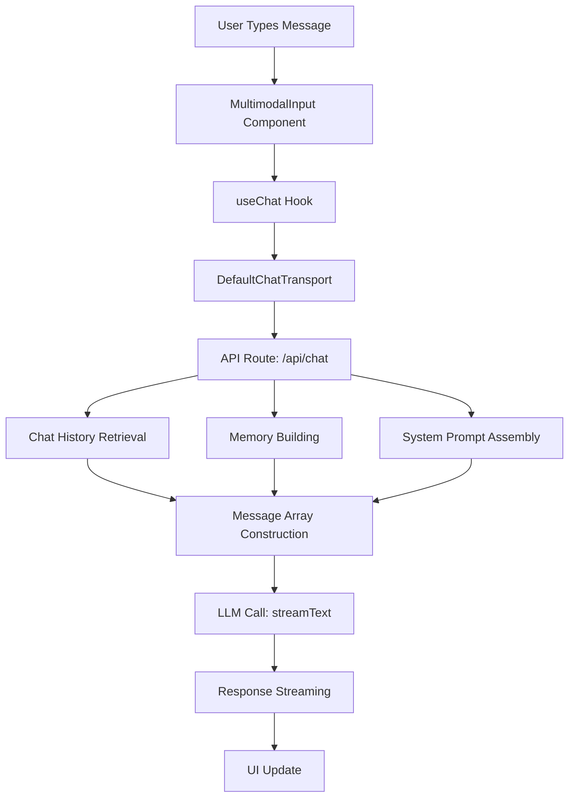

# User Input to LLM Processing Flow

## Overview

This document outlines the complete journey of user input from the chat interface through to the LLM response, including memory integration, system prompts, and tool usage. The system processes user messages, builds context from conversation history, and sends a carefully constructed prompt to the LLM.

## Architecture Flow



## Phase 1: User Input Processing

### Location: `components/multimodal-input.tsx`

The user input journey begins in the chat input component:

```typescript
const submitForm = useCallback(() => {
  // Send message via useChat hook
  sendMessage({
    role: 'user',
    parts: [
      // Handle file attachments
      ...attachments.map(attachment => ({
        type: 'file',
        url: attachment.url,
        name: attachment.name,
        mediaType: attachment.contentType,
      })),
      // Handle text input
      {
        type: 'text',
        text: input,  // ← User input here
      },
    ],
  });
  // ...
}, [input, attachments, sendMessage, chatId]);
```

**Key Responsibilities:**
- Process user text and file attachments
- Format data into standardized message structure
- Trigger message transmission via `sendMessage()`

### Message Structure

Each user message follows this format:
```typescript
type ChatMessage = {
  id: string;
  role: 'user' | 'assistant';
  parts: Array<{
    type: 'text' | 'file' | 'tool-result';
    text?: string;
    url?: string;
    // ... other properties
  }>;
};
```

## Phase 2: Message Transport

### Location: `components/chat.tsx`

The `useChat` hook handles message transport:

```typescript
const {
  messages,
  setMessages,
  sendMessage,
  status,
  stop,
  regenerate,
  resumeStream,
} = useChat<ChatMessage>({
  id,
  messages: initialMessages,
  experimental_throttle: 100,
  generateId: generateUUID,
  // Transport layer configuration
  transport: new DefaultChatTransport({
    api: '/api/chat',  // ← API endpoint destination
    fetch: fetchWithErrorHandlers,
    // Message preparation for API
    prepareSendMessagesRequest({ messages, id, body }) {
      return {
        body: {
          id,
          message: messages.at(-1),  // ← Latest user message
          selectedChatModel: initialChatModel,
          selectedVisibilityType: visibilityType,
          ...body,
        },
      };
    },
  }),
  // ... other configuration
});
```

**Key Responsibilities:**
- Manage message state and history
- Handle transport layer communication
- Prepare messages for API transmission
- Manage streaming responses

## Phase 3: API Route Processing

### Location: `app/(chat)/api/chat/route.ts`

This is where the actual LLM processing happens:

```typescript
export async function POST(request: Request) {
  // 1. Parse request
  const {
    id,
    message,
    selectedChatModel,
    selectedVisibilityType,
  }: {
    id: string;
    message: ChatMessage;
    selectedChatModel: ChatModel['id'];
    selectedVisibilityType: VisibilityType;
  } = requestBody;

  // 2. Authentication & authorization checks
  const session = await auth();
  // ... auth validation

  // 3. Retrieve conversation history
  const messagesFromDb = await getMessagesByChatId({ id });
  const uiMessages = [
    ...convertToUIMessages(messagesFromDb),
    sanitizedMessage,  // ← Current user message
  ];

  // 4. Memory processing (if enabled)
  let memoryBrief = '';
  let systemWithMemory = systemPrompt({ selectedChatModel, requestHints });

  if (enableMemorySlice) {
    // Build memory context from conversation
    const memoryBlock = formatStructuredMemoryToPrompt(enhancedMemory);
    systemWithMemory = `${systemWithMemory}\n\n${memoryBlock}`;
  }

  // 5. Prepare messages for LLM
  const messagesToSend = uiMessages.slice(-dynamicLastK);

  // 6. LLM call with streaming
  const result = streamText({
    model: myProvider.languageModel(selectedChatModel),
    system: systemWithMemory,  // ← System prompt with memory
    messages: convertToModelMessages(messagesToSend),  // ← Message history
    // ... tool configuration
    experimental_activeTools: [
      'getWeather',
      'createDocument',
      'updateDocument',
      'requestSuggestions',
    ],
    tools: {
      getWeather,
      createDocument: createDocument({ session, dataStream, memoryBrief }),
      updateDocument: updateDocument({ session, dataStream, memoryBrief }),
      requestSuggestions: requestSuggestions({ session, dataStream }),
    },
  });
}
```

## Phase 4: Memory Integration

### Location: `lib/ai/memory-utils.ts`

Memory extraction and formatting:

```typescript
// Extract structured memory from conversation
const structuredMemory = await getSummarizer().summarizeStructured(
  convo,  // ← Conversation history
  language,
);

// Apply recency weighting
const enhancedMemory = recencyWeighting(
  structuredMemory,
  recentMessages,  // ← Recent conversation context
);

// Format for system prompt
const memoryBlock = formatStructuredMemoryToPrompt(enhancedMemory);

// Create tool memory brief
const memoryBrief = createToolMemoryBrief(enhancedMemory);
```

### Memory Structure

```typescript
type StructuredMemory = {
  facts: Array<{
    content: string;
    confidence: number;
    lastReferenced: Date;
  }>;
  decisions: Array<{
    content: string;
    rationale: string;
    confidence: number;
  }>;
  openItems: Array<{
    content: string;
    priority: 'high' | 'medium' | 'low';
  }>;
  metadata: {
    confidence: number;
    language: string;
    summary: string;
  };
};
```

## Phase 5: System Prompt Assembly

### Location: `lib/ai/prompts.ts`

System prompt construction:

```typescript
export const systemPrompt = ({
  selectedChatModel,
  requestHints,
}: {
  selectedChatModel: string;
  requestHints: RequestHints;
}) => {
  const requestPrompt = getRequestPromptFromHints(requestHints);

  if (selectedChatModel === 'chat-model-reasoning') {
    return `${pedritoPrompt}\n\n${requestPrompt}`;
  } else {
    return `${pedritoPrompt}\n\n${requestPrompt}\n\n${artifactsPrompt}`;
  }
};

// Final system message with memory
const systemPromptWithMemory = enableMemorySlice
  ? systemWithMemory  // ← System prompt + memory block
  : systemPrompt({ selectedChatModel, requestHints });
```

### System Prompt Components

1. **Base Personality Prompt** (`pedritoPrompt`)
   - Character definition and communication style
   - Response guidelines and boundaries

2. **Request Context** (`requestPrompt`)
   - Geographic location data
   - Request origin information

3. **Artifact Tools** (`artifactsPrompt`)
   - Document creation guidelines
   - Tool usage rules

4. **Memory Context** (when applicable)
   - Extracted conversation facts
   - Decision history
   - Open items and action items

## Phase 6: Message Array Construction

### Final Message Array Structure

```typescript
const messages = [
  {
    role: 'system',
    content: `You are Pedrito...
[MEMORY]
Previous conversation facts and context...

[LOCATION]
User location data...

[ARTIFACTS]
Document creation guidelines...`
  },
  // Previous conversation history (last N messages)
  { role: 'user', content: 'Previous user message' },
  { role: 'assistant', content: 'Previous AI response' },
  // Current interaction
  { role: 'user', content: userMessage.content }  // ← Current user input
];
```

### Context Window Management

**NOT a Fixed Number - DYNAMICALLY Calculated Based on Conversation Complexity:**

```typescript
// Dynamic message limiting based on token count
const dynamicLastK = Math.max(
  4,  // Minimum messages (always at least 4)
  Math.min(
    lastKMax,  // Maximum messages (default: 10)
    Math.round(tokensApprox / 500) + 3  // Token-based calculation
  )
);
const messagesToSend = uiMessages.slice(-dynamicLastK);
```

**Message Count Examples:**
- **Simple conversation**: 4 messages minimum
- **Complex conversation**: Up to 10 messages maximum
- **High token usage**: More messages for context
- **Low token usage**: Fewer messages to save tokens

**Benefits:**
- **Optimal context** for each conversation type
- **Cost efficiency** by avoiding unnecessary tokens
- **Performance balance** between context quality and speed

## Phase 7: LLM Call and Response

### AI SDK Integration

```typescript
const result = streamText({
  model: myProvider.languageModel(selectedChatModel),
  system: systemPromptWithMemory,
  messages: convertToModelMessages(messagesToSend),

  // Tool configuration
  experimental_activeTools: [
    'getWeather',
    'createDocument',
    'updateDocument',
    'requestSuggestions',
  ],

  // Tool implementations
  tools: {
    getWeather: getWeather,
    createDocument: createDocument({ session, dataStream, memoryBrief }),
    updateDocument: updateDocument({ session, dataStream, memoryBrief }),
    requestSuggestions: requestSuggestions({ session, dataStream }),
  },

  // Streaming configuration
  experimental_transform: smoothStream({ chunking: 'word' }),
});

// Stream response back to UI
dataStream.merge(
  result.toUIMessageStream({
    sendReasoning: process.env.NODE_ENV !== 'production',
  })
);
```

## Integration Points

### Tool Memory Sharing

All tools receive the same `memoryBrief` for consistent context:

```typescript
createDocument({
  session,
  dataStream,
  memoryBrief,  // ← Same memory across all tools
})
```

### Resumable Streams

For production reliability:

```typescript
const streamContext = getStreamContext();
if (streamContext) {
  return new Response(
    await streamContext.resumableStream(streamId, () =>
      stream.pipeThrough(new JsonToSseTransformStream()),
    ),
  );
}
```

### Message Persistence

After streaming completion:

```typescript
onFinish: async ({ messages }) => {
  await saveMessages({
    messages: messages.map(message => ({
      id: message.id,
      role: message.role,
      parts: message.parts,
      createdAt: new Date(),
      attachments: [],
      chatId: id,
    })),
  });
}
```

## Error Handling

### Authentication & Authorization

```typescript
if (!session?.user) {
  return new ChatSDKError('unauthorized:chat').toResponse();
}

if (messageCount > entitlementsByUserType[userType].maxMessagesPerDay) {
  return new ChatSDKError('rate_limit:chat').toResponse();
}
```

### Memory Fallback

```typescript
try {
  // Primary memory extraction
  const structuredMemory = await getSummarizer().summarizeStructured(convo, language);
} catch (err) {
  // Fallback to simple summary
  const summary = await getSummarizer().summarizePlain(convo, tier, language);
}
```

## Configuration Controls

### Memory Thresholds

```typescript
const MIN_TURNS_FOR_SUMMARY = Number(process.env.MEMORY_MIN_TURNS ?? 5);
const minTokens = Number(process.env.MEMORY_MIN_TOKENS ?? 400);
const minSal = Number(process.env.MEMORY_MIN_SALIENCE ?? 3);
```

### Context Window Limits

```typescript
const lastKMax = Number(process.env.MEMORY_LAST_K_MAX ?? 10);
const dynamicLastK = Math.max(4, Math.min(lastKMax, Math.round(tokensApprox / 500) + 3));
```

## Complete Data Flow

```
┌─────────────────┐    ┌──────────────────┐    ┌─────────────────┐
│  User Input     │ -> │  useChat Hook    │ -> │  API Route      │
│                 │    │                  │    │                 │
│ - Text content  │    │ - Message state  │    │ - Auth check    │
│ - Attachments   │    │ - Transport      │    │ - Rate limit    │
│ - Message ID    │    │ - Streaming      │    │ - Sanitize      │
└─────────────────┘    └──────────────────┘    └─────────────────┘
                                                          │
                                                          ▼
┌─────────────────┐    ┌──────────────────┐    ┌─────────────────┐
│  Chat History   │ <- │  Database        │    │  Memory Build   │
│                 │    │                  │    │                 │
│ - Previous msgs │    │ - getMessages    │    │ - Extract facts │
│ - Context       │    │ - getChatById   │    │ - Decisions      │
└─────────────────┘    └──────────────────┘    └─────────────────┘
                                                          │
                                                          ▼
┌─────────────────┐    ┌──────────────────┐    ┌─────────────────┐
│  System Prompt  │ -> │  Message Array   │ -> │  LLM Call       │
│                 │    │                  │    │                 │
│ - Personality   │    │ - System msg     │    │ - Streaming     │
│ - Memory        │    │ - History        │    │ - Tools         │
│ - Guidelines    │    │ - User input     │    │ - Response      │
└─────────────────┘    └──────────────────┘    └─────────────────┘
                                                          │
                                                          ▼
┌─────────────────┐    ┌──────────────────┐    ┌─────────────────┐
│  UI Streaming   │ -> │  Message Save    │ -> │  Database       │
│                 │    │                  │    │                 │
│ - Real-time     │    │ - Response       │    │ - Persistence   │
│ - Updates       │    │ - Attachments    │    │ - History       │
│ - Tools         │    │ - Timestamp      │    └─────────────────┘
└─────────────────┘    └──────────────────┘
```

## Key Files Reference

| Component | File | Purpose |
|-----------|------|---------|
| User Input | `components/multimodal-input.tsx` | User message collection and formatting |
| Chat Hook | `components/chat.tsx` | Message state management and transport |
| API Route | `app/(chat)/api/chat/route.ts` | LLM processing and tool integration |
| Memory Utils | `lib/ai/memory-utils.ts` | Memory extraction and formatting |
| System Prompts | `lib/ai/prompts.ts` | Prompt construction and personality |
| Tool Implementations | `lib/ai/tools/` | Weather, documents, suggestions |
| Database Queries | `lib/db/queries.ts` | Message and chat persistence |

## Configuration

### Environment Variables

```bash
# Memory configuration
MEMORY_SLICE=1                    # Enable memory processing
MEMORY_MIN_TURNS=5              # Minimum conversation turns for memory
MEMORY_MIN_TOKENS=400           # Token threshold for summarization
MEMORY_MIN_SALIENCE=3           # Salience threshold for memory
MEMORY_LAST_K_MAX=10            # Maximum messages in context

# Production settings
NODE_ENV=production              # Disable reasoning in production
REDIS_URL=redis://...           # Resumable streams configuration
```

### Model Selection

```typescript
const selectedChatModel = 'chat-model-standard'; // or 'chat-model-reasoning'
```

## Error Scenarios

1. **Authentication Failure**: 401 Unauthorized
2. **Rate Limit Exceeded**: 429 Too Many Requests
3. **Memory Processing Failure**: Falls back to simple summary
4. **Tool Execution Error**: Graceful error handling
5. **Streaming Interruption**: Resumable stream recovery

## Best Practices

1. **Memory Management**: Keep context relevant and concise
2. **Tool Integration**: Pass memory brief to all tools
3. **Error Resilience**: Multiple fallback strategies for memory
4. **Performance**: Dynamic context window sizing
5. **Security**: Input sanitization at API boundary
6. **Scalability**: Rate limiting and entitlement validation

## Monitoring Points

- Token usage estimation
- Memory confidence scores
- Tool execution success rates
- Response streaming performance
- Error rates by component
- Memory extraction accuracy

This comprehensive flow ensures that every user message receives contextual, personalized responses with full access to conversation history and relevant tools.
